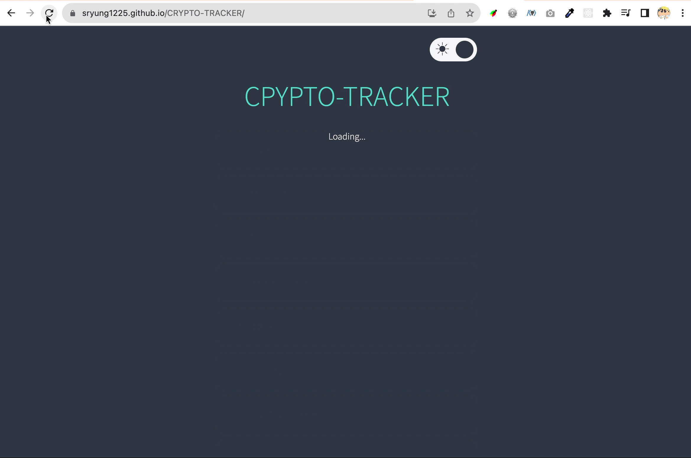
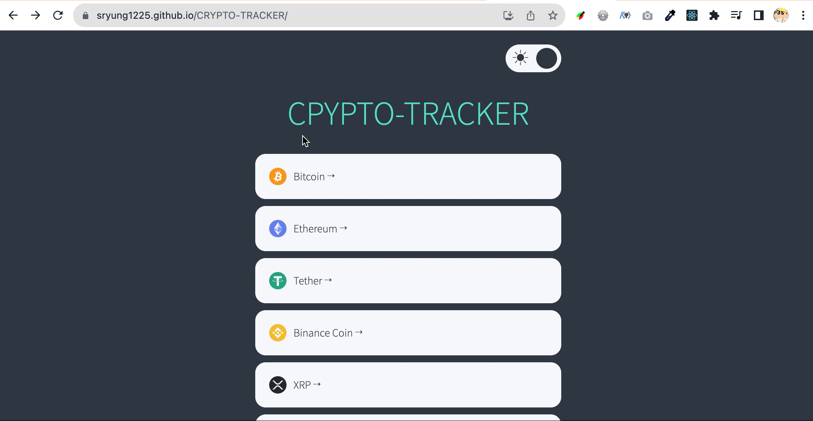
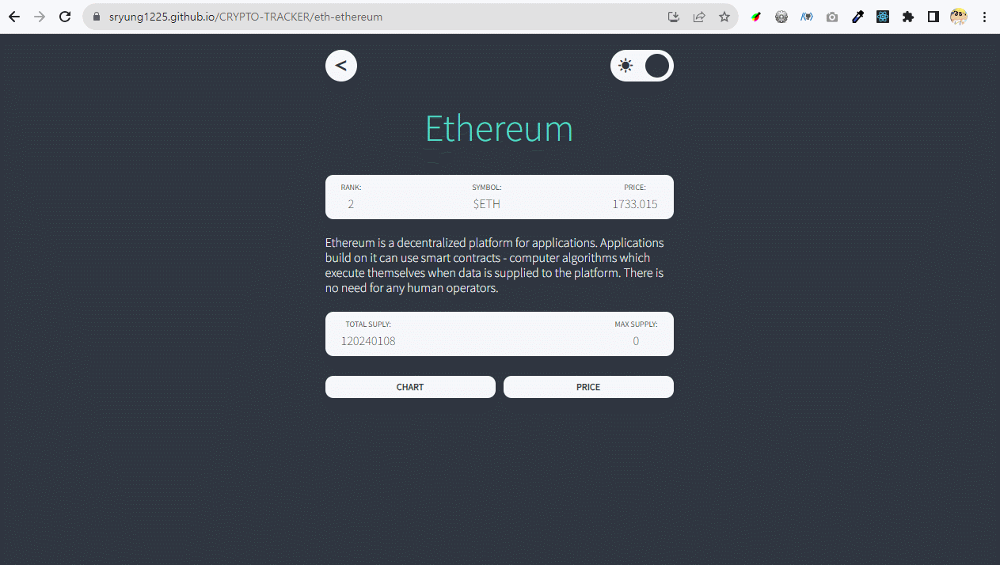
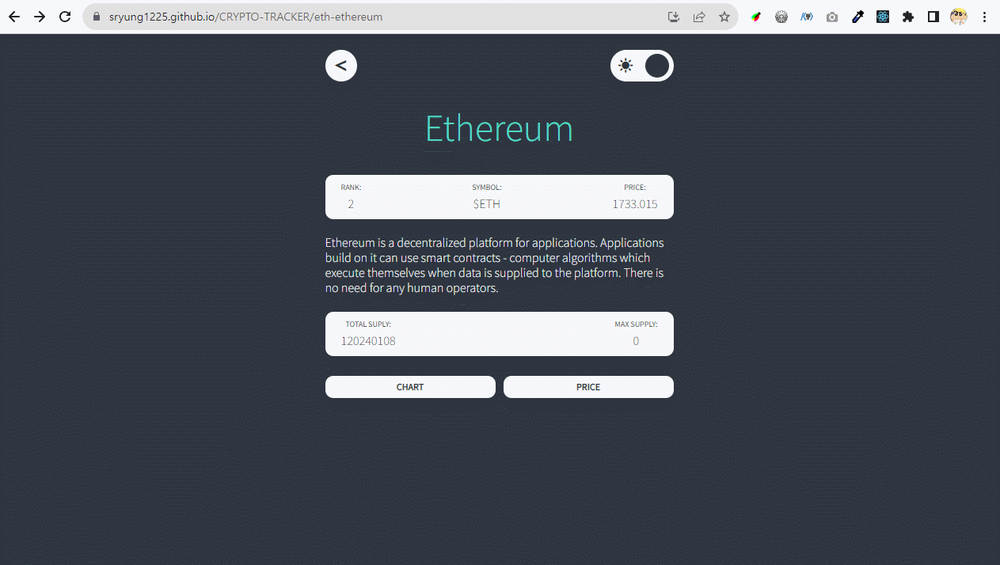

# 🪙 CRYPTO-TRACKER

노마드코더의 [[React JS 마스터클래스](https://nomadcoders.co/react-masterclass)] 강의를 수강하면서  

ReactJS와 TypeScript를 이용해 초안을 만들고, Recoil과 React-Query를 사용하며 개선해나가는  

암호화폐의 실시간 정보를 보여주는 웹페이지 **CRYPTO-TRACKER**를 제작했습니다.

> https://sryung1225.github.io/CRYPTO-TRACKER

  

🚩 권장 사용 환경: Window10, Chrome  

🚩 사용 기술:        
(react-router-dom 은 최신 6버전이 아닌 5버전을 사용했습니다.)  

 

---

 

## 📀 데이터

코인 데이터는 [Coinpaprika API](https://api.coinpaprika.com/v1/coins)와 [노마드코더 자체 제작 API](https://ohlcv-api.nomadcoders.workers.dev/?coinId=btc-bitcoin)를 사용했으며  
데이터를 fetch하는 과정에서는 react-query를 활용했습니다.  
코인 아이콘 이미지는 [Crypto Icon API](https://coinicons-api.vercel.app/)를 사용했습니다.  

 

---

 

## 1️⃣ Coins (Home)

기본 홈 화면에서는 코인들의 이름과 아이콘 이미지를 현재 순위 기반으로 나열합니다.  

각 코인을 클릭하면 코인에 대한 상세 정보를 확인할 수 있는 Coin 화면으로 이동합니다.  

  

 

## 2️⃣ Coin (Detail)

각 코인에 대한 정보를 보여줍니다.  

선택된 코인 아이디(coinId)를 이용해 순위, 가격, 공급량 등을 화면에 렌더링해 제공합니다.  

좌측 상단에 위치한 ⬅️ 버튼을 클릭하면 Coins 화면으로 되돌아갑니다.  

(뒤로가기 버튼은 Link to를 이용해 구현했는데, chart와 price 탭 활성화의 경우도 url이 변경되도록 route를 설정했기 때문)

  

 

## 3️⃣ Chart

해당 코인에 대한 최신 가격 정보를 candlestick 차트로 보여줍니다.  

차트는 [Apexchart](https://apexcharts.com/) 라이브러리를 활용해서 표현합니다.  

전날과 비교해서 하락한 경우는 파란색, 상승한 경우는 빨간색 그래프로 표현합니다.  

  

 

## 4️⃣ Price

해당 코인에 대한 지난 가격 정보를 요약적인 수치로 표현해 보여줍니다.  

현재와 비교해서 하락한 경우는 파란색, 상승한 경우는 빨간색 글자로 표현합니다.  

  

 

## 5️⃣ Theme Switch

우측 상단에 위치한 스위치를 이용해 light와 dark로 테마를 전환합니다.  

기본 테마는 dark이며 선택된 테마에 따라서 배경색과 글자색이 변화합니다.  

  

---

이론 및 세부 작업 정리 : [[📚 Notion](https://eve1225.notion.site/3-5-5-0-6-4-23dfd7da3caf4f7ebe9799636d4598b4?pvs=4)]  
